# Warehouse Inventory — Data-Quality Audit & Exploratory Analysis

An end-to-end analysis of a 1,000-row warehouse inventory export: taking the
raw, inconsistent file through a documented cleaning pipeline, then using the
cleaned data both to **audit the dataset's trustworthiness** and to answer
eight analytical questions about stock health, capital, and supply.

**Tools:** Python · pandas · NumPy · Matplotlib · seaborn · Jupyter

**Deliverables:**

- [`wareh_cleaning.ipynb`](wareh_cleaning.ipynb) — the full cleaning pipeline
- [`wareh_analysis.ipynb`](wareh_analysis.ipynb) — exploratory analysis & visualisations
- [`data/warehouse_clean.csv`](data/warehouse_clean.csv) — the validated output dataset
- [`figures/`](figures/) — all generated charts

> *Figure references below point at the `figures/` directory; if a filename
> differs from your saved output, adjust the path.*

---

## 1. Executive Summary

This dataset was treated as a professional hand-off: *"here is our warehouse
export — clean it, analyse it, and tell us what it says."* The cleaning was
straightforward. The **trustworthiness was not.**

**Verdict up front:** this export is **safe for aggregate, row-level reporting
but unsafe as a system of record.** Three structural integrity problems mean
it cannot be joined on its identifier, its stock-status field cannot be
believed, and its near-uniform distributions indicate it does not reflect
real operational behaviour. The legitimate insights that survive are reported
in full — chief among them that inventory *value* is meaningfully
concentrated even though every input column is not.

**The three trust problems (detailed in §5):**

1. **`Product ID` is not a key.** 238 of 615 IDs describe more than one
   distinct product — it cannot be used to join, deduplicate, or count
   products.
2. **`Status` contradicts `Quantity`.** Of 332 rows marked *Out of Stock*,
   **zero** are confirmed at zero quantity; 280 are physically holding stock.
   The status field is disconnected from inventory on hand.
3. **The data is near-uniform across every categorical**, which is not what
   real inventory looks like — a strong indication the file is synthetic or
   randomly generated rather than drawn from live operations.

**The headline legitimate finding:** total inventory value is **~$2.95M**
(across the 661 rows with both quantity and price), and it is **moderately
concentrated** — the top 20% of stocked items hold 47% of that value, and the
top half hold 78%.

---

## 2. Data Cleaning

The raw file, `warehouse_messy_data.csv`, loaded as a normal comma-separated
UTF-8 CSV — no encoding or delimiter war. Its problems lived inside the
columns. A column-by-column **damage report** catalogued every defect before
any repair began, and every judgment call was documented in the cleaning
notebook.

### 2.1 Structural

| Check | Result |
| --- | --- |
| Column headers | Renamed all 10 to clean `snake_case` |
| Fully-blank rows | Checked — none found |
| Exact duplicate rows | Checked — none found (0 dropped) |
| Row count | 1,000 in → 1,000 out |

### 2.2 Column-by-column repair

| Column | Problem | Resolution |
| --- | --- | --- |
| `product_name` | Every value space-padded and lowercase (`' gadget y '`) | Stripped whitespace, normalised to Title Case → 6 clean names |
| `category` | ALL-CAPS (`ELECTRONICS`) | Normalised to Title Case → 4 clean categories |
| `status` | — | Verified: 3 canonical values, no variants. No cleaning needed |
| `price` | 207 missing (~21%) | **Left as `NaN`** — see judgment call below |
| `quantity` | Mixed type: integers *and* the word `two hundred`, plus 158 missing | Converted `two hundred` → 200, coerced to numeric, cast to nullable `Int64` (holds whole numbers **and** missing) |
| `last_restocked` | `DD/MM/YYYY` text strings + 200 missing | Parsed with explicit `format='%d/%m/%Y'`; missing became `NaT`; sanity-checked — all dates in the past |
| `product_id` | Not a reliable key (see §5.1) | **Retained as-is**, flagged — not dropped, not used as index |

### 2.3 Judgment calls (documented, not silent)

- **Price — impute vs. drop → neither.** Before choosing, we tested whether
  price is *predictable* from any other column. It is not: every product and
  every category carries all four price tiers (`9.99, 19.99, 29.99, 49.99`)
  in roughly equal share. With no signal to impute *from*, a global-median
  fill would have stamped a fabricated $29.99 onto 21% of rows and distorted
  every downstream value calculation. Decision: **retain missing prices as
  `NaN`; exclude them per-calculation.** Price-based metrics therefore run on
  the 793 priced rows.
- **Quantity — same test, same conclusion.** Quantity is likewise
  unpredictable from product, category, or status. The 158 missing quantities
  were **retained as `NaN`** for the same reason.
- **Status vs. Quantity — deliberately *not* "fixed."** It is tempting to
  set `quantity = 0` wherever `status = 'Out of Stock'`. We did **not**,
  because it would overwrite real data on the authority of a field we already
  distrust (§5.2). Cleaning recovers intended values; it does not invent them
  from a contradictory signal. The contradiction is reported, not laundered.

### 2.4 Validation & output

A cell of `assert` statements verified every guarantee before saving: correct
dtypes (`quantity` → `Int64`, `price` → float, `last_restocked` → datetime),
canonical value sets for `category`/`status`, expected-missing preserved, and
row count unchanged at 1,000. The result was written to
[`data/warehouse_clean.csv`](data/warehouse_clean.csv); all analysis reads
from this file — cleaning and analysis are kept strictly separate.

---

## 3. The Cleaned Dataset

**1,000 rows × 10 columns** (plus a derived `inventory_value = quantity ×
price`).

| Column | Type | Notes |
| --- | --- | --- |
| `product_id` | integer | **Not a reliable key** — see §5.1 |
| `product_name` | text | 6 products |
| `category` | categorical | 4 categories |
| `warehouse` | categorical | 3 warehouses |
| `location` | categorical | 5 aisles |
| `quantity` | Int64 (nullable) | 158 missing |
| `price` | float | 207 missing |
| `supplier` | categorical | 4 suppliers |
| `status` | categorical | In / Out / Low Stock |
| `last_restocked` | datetime | 200 missing; only 4 distinct dates |

---

## 4. Univariate EDA

### 4.1 Categorical columns

Every categorical is strikingly **even**:

| Column | Distribution |
| --- | --- |
| `category` | Furniture 265 · Clothing 257 · Electronics 248 · Toys 230 |
| `warehouse` | W1 349 · W2 332 · W3 319 |
| `location` | Aisle 3 211 · Aisle 1 210 · Aisle 4 199 · Aisle 5 199 · Aisle 2 181 |
| `supplier` | B 288 · A 244 · D 236 · C 232 |
| `status` | In Stock 340 · Out of Stock 332 · Low Stock 328 |
| `product_name` | Gadget Y 177 · Widget A 176 · Widget C 175 · Widget B 170 · Gadget Z 169 · Gadget X 133 |

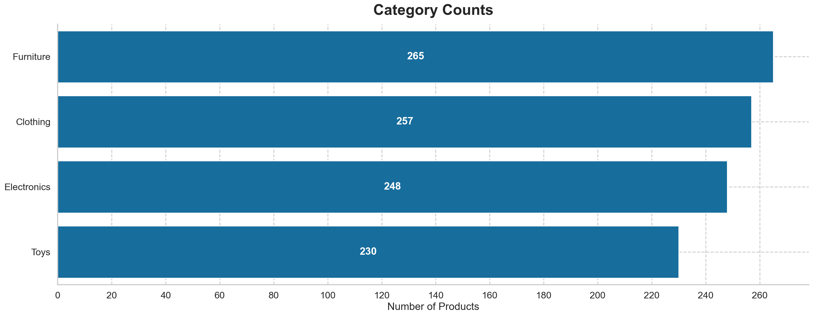 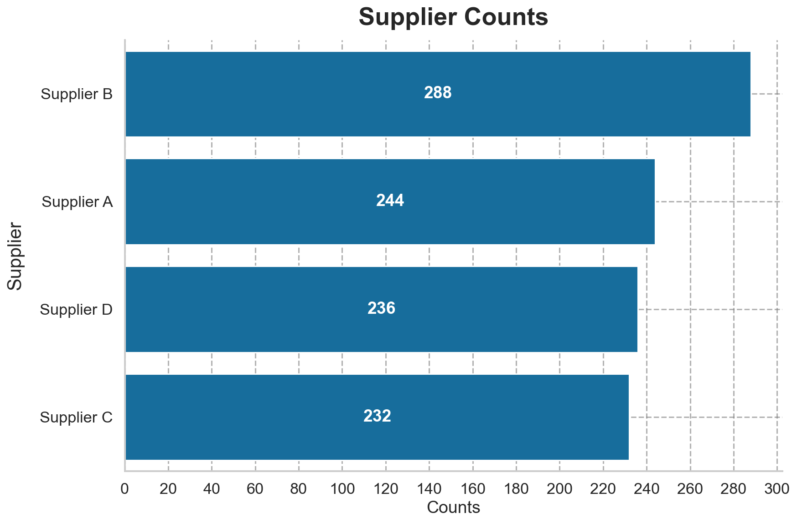

### 4.2 Numeric columns

Both "numeric" columns are in fact a **handful of discrete tiers**, not
continuous measures:

- `quantity`: only 5 values — 300 (177), 150 (175), 50 (169), 100 (161), 200 (160).
- `price`: only 4 values — 29.99 (211), 49.99 (204), 19.99 (197), 9.99 (181).

The one genuinely spread numeric is the derived `inventory_value`, which
ranges from **$499.50** (50 × $9.99) to **$14,997** (300 × $49.99) — a **30×
range** — and is right-skewed.

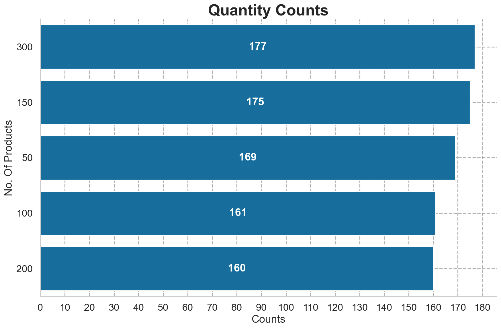 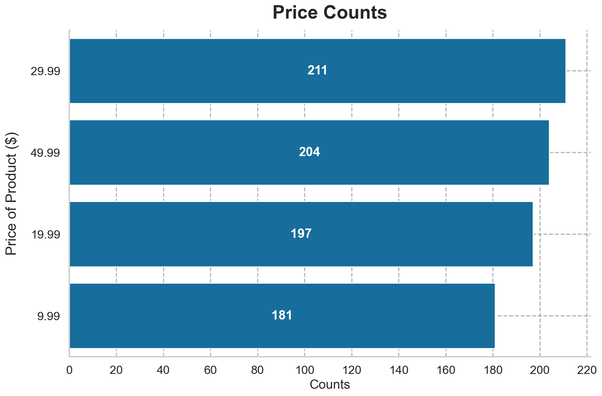

### 4.3 Missingness

Three columns are materially incomplete: `price` 207 (20.7%), `last_restocked`
200 (20.0%), `quantity` 158 (15.8%). All other columns are complete.

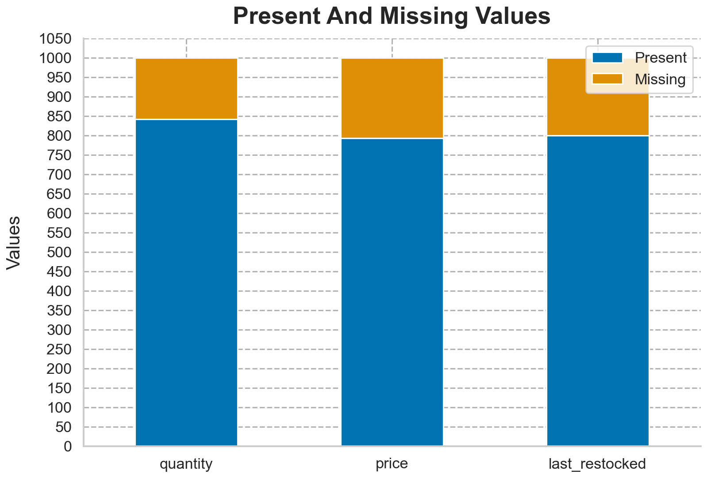

### 4.4 Three surprises

1. **Every categorical is near-uniform.** Real inventory is lumpy —
   bestsellers, dead stock, favoured suppliers. Flatness across *every*
   dimension points to randomly generated rather than operational data.
2. **The "numeric" columns are only a few tiers.** 5 quantities and 4
   prices — genuine measures don't collapse into tidy round numbers. (This
   is why a histogram would mislead on `quantity`/`price` directly.)
3. **A fifth of key columns is missing, and stock status disagrees with
   stock on hand** (developed in §5.2).

---

## 5. Data-Integrity Findings (the audit)

This is the core of the report: the three problems that determine what the
data can and cannot be trusted to do.

### 5.1 `Product ID` is not a key

The column looks like a primary identifier but does not behave like one. Of
**615** distinct IDs across 1,000 rows, **238** map to *more than one distinct
product name* — the same ID describes different products, categories, and
prices in different rows (e.g. ID 1098 appears 7 times as 4 different
products).

**Consequence:** `product_id` must **not** be used as a join key, a
deduplication key, or a basis for counting distinct products — it will
silently lie. It is retained only for traceability back to the source system.

### 5.2 `Status` contradicts `Quantity`

Cross-tabulating `status` against `quantity` shows the *Out of Stock* label
spread **evenly across every positive quantity** (44–69 rows at each of 50,
100, 150, 200, 300). There is **no quantity of 0 anywhere in the dataset.**

The hard numbers: of **332** *Out of Stock* rows, **280** are physically
holding stock and the remaining 52 have a *missing* quantity — so **0 of 332
are confirmed at zero stock.** Not one supports the label.

**Consequence:** the `status` field is disconnected from inventory on hand and
cannot be believed. One of the two systems feeding this export (the status
flag or the quantity count) is unreliable; the business must declare which is
authoritative.

### 5.3 The data is signal-free

The uniformity in §4.1, the tidy discrete tiers in §4.2, and the random
ID→product mapping in §5.1 together indicate the file is **synthetic or
randomly generated.** Analytically, this means most relationships come out
flat — and where a "finding" appears, it must be checked against whether it
could arise from chance alone.

---

## 6. Analytical Questions & Verdicts

Each question states its business purpose, the finding, and a **verdict** —
including honest null results, which on this data are the norm. Unless noted,
value-based questions run on the **661 rows** with both quantity and price
present, so all capital totals are **lower bounds.**

### Q1 — Where is our capital tied up?

Total inventory value is **~$2.95M**. By warehouse it is essentially even
(W2 $1.03M, W1 $0.99M, W3 $0.94M); by category, Electronics leads ($830K) and
Toys trails ($607K). The 2-D pivot (category × warehouse) is lumpier than
either margin — e.g. Electronics-in-W2 is the single largest cell ($334K)
while Toys-in-W2 is among the smallest ($156K).

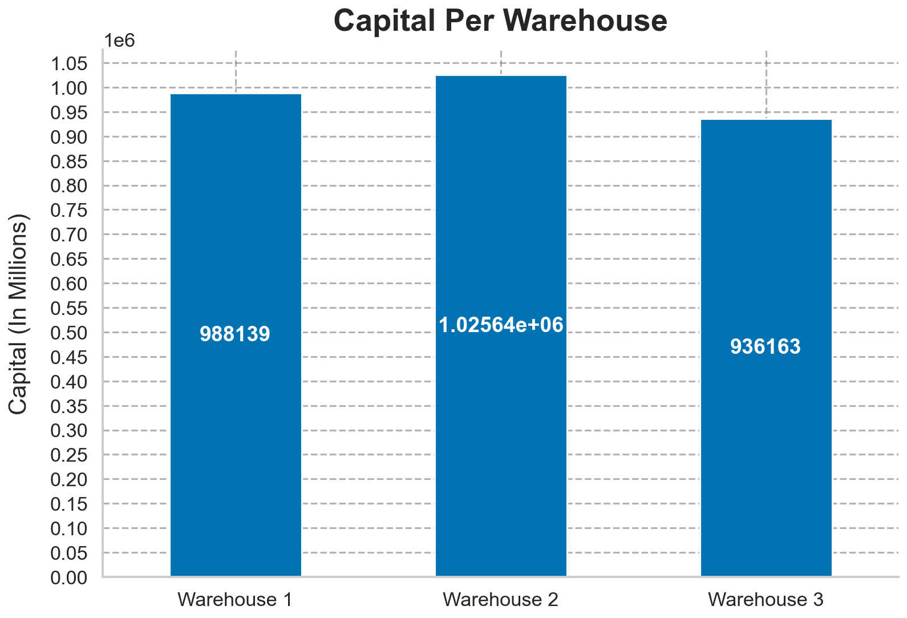 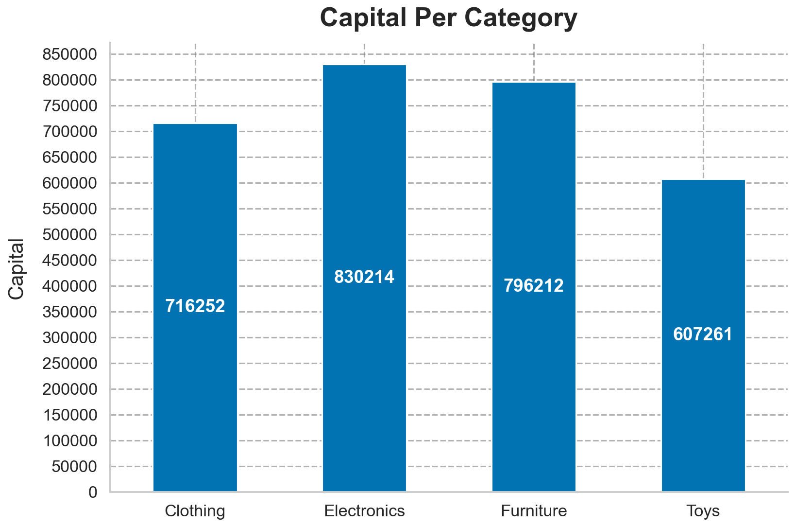

**Verdict:** capital is broadly even across sites; **marginal totals look
flat, but the joint category×warehouse view is not** — a reminder to always
check the 2-D cut before declaring uniformity.

### Q2 — Which warehouse has the worst stock health?

Out-of-stock **rate** (not raw count, to correct for differing warehouse
sizes): W2 34.6%, W3 32.6%, W1 32.4%. Overall 33.2%.

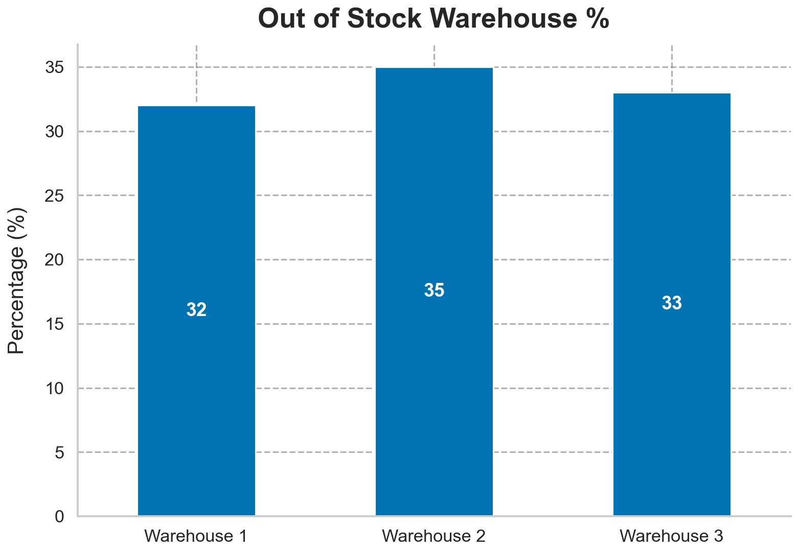

**Verdict:** **null result** — no warehouse is meaningfully worse. *(Caveat:
because `status` is unreliable per §5.2, this "stock health" metric is itself
suspect.)*

### Q3 — Do suppliers differ in how recently they restock?

Average days since last restock (relative to the latest date in the data, over
the ~800 dated rows): Supplier D 68, B 70, A 71, C 77.

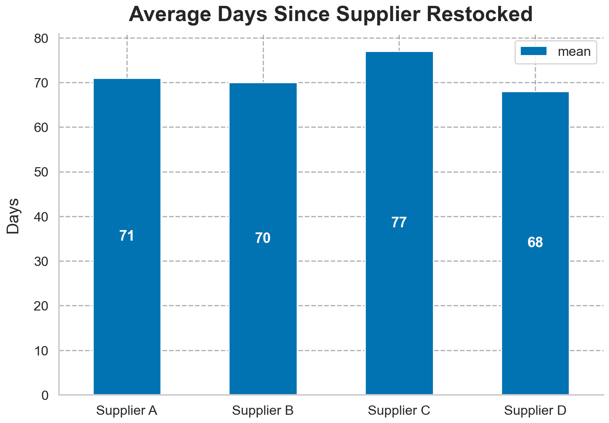

**Verdict:** **null result** — a 9-day spread on a column with only 4 distinct
dates is low-resolution noise, not a supplier signal.

### Q4 — How old is our inventory, and how much value is stale?

Binning restock-age and summing value gives roughly even buckets ($505K–$633K).
**Important caveat:** with only 4 distinct dates, each age bucket contains
exactly one date, so this is "value per restock batch" rather than a true
aging curve — and the **200 undated rows** fall into no bucket, so genuinely
old stock could be invisible here.

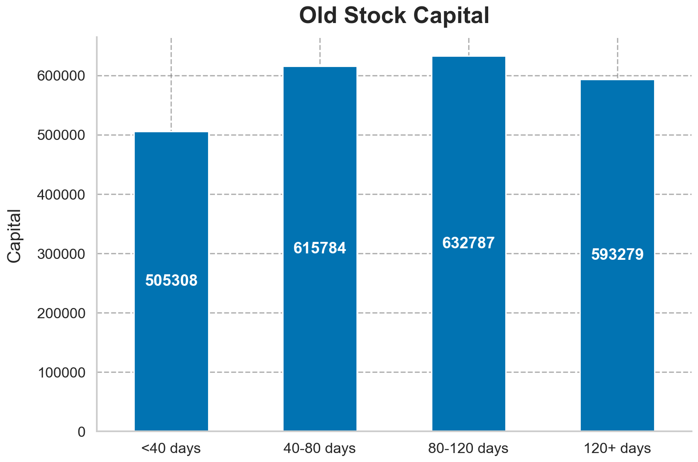

**Verdict:** **inconclusive** — the date resolution and the undated rows
prevent a real stale-stock answer.

### Q5 — Does `status` agree with `quantity`?

No. See §5.2 — **0 of 332** *Out of Stock* rows are confirmed at zero stock,
and status is smeared evenly across all quantities.

**Verdict:** **the strongest finding in the report** — a confirmed data-quality
defect, quantified.

### Q6 — Does product mix skew premium in any category or supplier?

Two views agree. Mean price per group is flat ($27.08–$28.95 across
categories; $27.68–$28.52 across suppliers). The normalised price-tier mix is
also flat — the premium ($49.99) tier holds 23–28% share in every category and
every supplier.

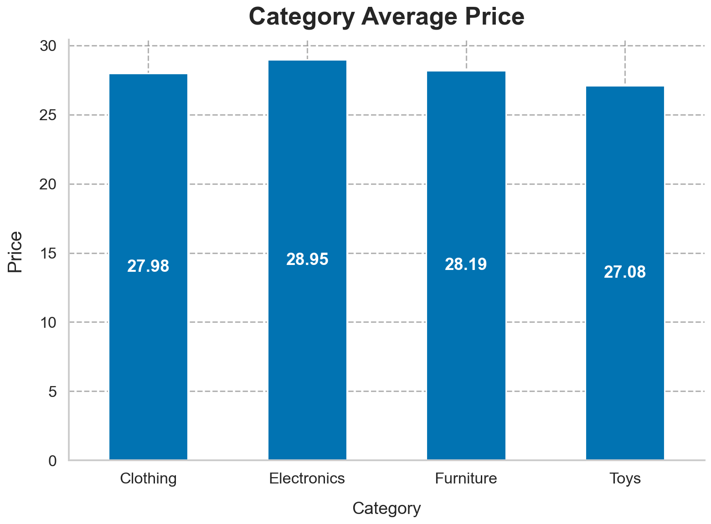 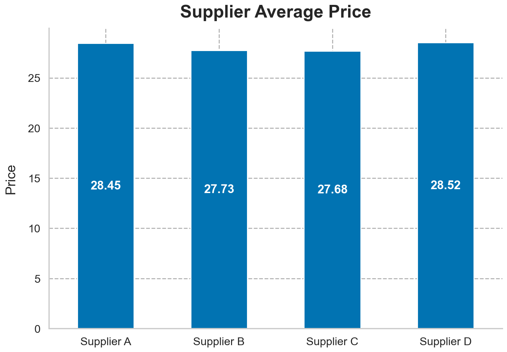

**Verdict:** **null result, cleanly proven** — no category or supplier skews
high- or low-value.

### Q7 — Is the missing data random or concentrated?

Missing-rates broken down by category, warehouse, and supplier all sit within
a ~10–25% band with no dramatic outlier (the widest gap being Electronics'
~10% missing-quantity rate vs. Clothing's ~22%).

**Verdict:** **no strong driver** — missingness is not concentrated in any one
warehouse or supplier, so it does not appear to stem from a single broken
feed. (Mild wobble noted, within noise.)

### Q8 — How concentrated is inventory value?

The one genuinely non-flat result. Sorting `inventory_value` descending and
taking cumulative share:

| Top _n_ of rows | Share of total value |
| --- | --- |
| 10% | 28% |
| 20% | 47% |
| 30% | 60% |
| 50% | 78% |

**Verdict:** **inventory value is moderately concentrated** — the top 20% of
stocked items hold nearly half the capital; the bottom half hold barely a
fifth. This arises because `inventory_value` is a *product* of two tiered
columns: multiplying spread-out factors compounds them into a 30× range, so
the high-quantity × high-price rows pull far ahead even though quantity and
price are individually uniform. **Uniform inputs, concentrated output.**

---

## 7. What the Data Can and Cannot Tell You

**Can (with caveats):**
- Total and distributional **inventory value** (~$2.95M, lower bound), and its
  concentration (Q8).
- Broad, even splits across warehouses, categories, suppliers, and aisles.
- A quantified account of its **own data-quality defects** (§5) — arguably the
  most useful deliverable.

**Cannot:**
- Anything keyed on `product_id` (joins, distinct-product counts).
- Anything relying on `status` being accurate (true stock health, out-of-stock
  exposure).
- True stock **aging** (4 dates, 200 undated rows).
- Generalisation to real operations — the data is not operationally realistic.

---

## 8. Conclusion & Recommendations

The cleaning phase produced a fully-typed, validated, reproducible dataset.
The **analysis phase's most valuable output is the audit**: this export has
three structural integrity problems that a naïve analyst would have reported
straight through as fact.

**Recommendations to the data owner:**
1. **Do not join or deduplicate on `Product ID`** — it is not unique to a
   product. Investigate how IDs are assigned upstream.
2. **Reconcile `Status` with `Quantity`.** They disagree in every checkable
   case and there are no zero quantities at all; decide which system is
   authoritative and repair the other.
3. **Investigate the ~20% missingness** in price, quantity, and restock date
   at source — it is not concentrated in one feed, suggesting a broad
   collection gap rather than one broken integration.
4. **Treat current distributions as non-representative.** The uniformity
   suggests this is test/synthetic data; validate against a live extract
   before making operational decisions.

**The one insight safe to act on:** inventory value is concentrated (top 20% of
items = 47% of capital), so cycle-counting and loss-prevention effort should
prioritise the high-quantity, premium-price items that dominate the balance
sheet.

**Overriding limitation:** ~1/3 of rows lack a price or quantity and so carry
no computed value; every capital figure here is a lower bound, and every
"even" distribution reflects data that does not look operationally real.

---

*Cleaning and analysis performed in Python. All figures reproducible from the
accompanying notebooks.*
